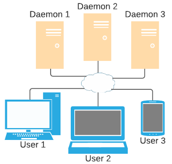

# Xerock

**Xerock** is a set o tools (Linux and Windows) to assist the development of low level communication between devices. The plataform aims different kinds of links, since physical connection (e.g. serial) to network protocols (e.g. TCP, WebSocket).

The application is divided into *daemon* (this project) and *interface* ([daemon project](https://github.com/rnascunha/xerock_web)). You can access the *interface* at [this address](https://rnascunha.github.io/xerock/).

The *daemon* is where the connections/protocols will be running, and at *interface* you can access the *daemons* (as many as you need) to interact/viasualize the data. All people connected to the same *daemon* will receive the same data traffic.

The software is composed by:

* *Apps*: applications provide the resources that the system will work on top. For example, the *Serial App* connects to serial ports, *TCP Server App* open listening tcp sockets, and so on.

* *Data* / *Views*: this module is all about visualization. The default view shows all data, from all the *apps*, from all *daemons*, and all metadata involved (timestamp, app, size, data...). There is also custom views, where data can be filterd, parsed and displayed in different ways.

* *Input* / *Commands*: here is how you send data to the *apps*. You can send data as **text**, **hexadecimal** or **binary**. Custom inputs, called *commads*, can be used to construct more complex data sets.

* *Scripts*: scripts are used to automated some procedure. For example, echoing all data received from some socket, or bridging data received from a serial port to a TCP socket, or vice-versa.

* *Tools*: tools are features to help develoment, but not tightly related with others. Some examples are data conversion or open saved data.

All features above are extensible, i.e., new *Apps*, *Views* , *Commands*, *Scripts* and *Tools* will be added in the future.

## How it works

 

* Users access the [interface](https://rnascunha.github.io/xerock/);

* At interface, users can connect to any the *daemons* they need;

* Users can send commands to *daemons* to open serial ports, open sockets, or any other resources the *daemon* provide. Different *daemons* require different type of connections (plain or SSL), and can be compiled with different sets of  _apps_ ;

* All data is shared by the users that are connected to the same *daemon* .

Other possibility, that doesn't require a *daemon*, is the **local apps**. **Local apps** are applications that use some API supplied by the browser. As everything runs locally, the data isn't shared, but all features described above (*Views* , *Commands*, *Scripts*) are still valid.

## Build and compile

### Dependecies

To build and compile **Xerock**, you will need:

* [git](https://git-scm.com/) - Download code and library dependecies;

* [cmake](https://cmake.org/) / Make - Build and compile;

* C++ compiler - C++ compiler with support C++17 standard;

**Xerock** depends on the following third party libraries:

* [Argh!](https://github.com/adishavit/argh) - Parse command line arguments;

* [Boost/Asio](https://github.com/boostorg/asio/) - Asyncronous model and serial/sockets implementation;

* [Boost/Beast](https://github.com/boostorg/beast) - WebSocket implementation on top of Asio;

* [RapidJSON](https://github.com/Tencent/rapidjson) - JSON parser and generator for C++;

* (Optional) [OpenSSL](https://www.openssl.org/) - SSL implementation. Only required if SSL support is needed.

### Quick start

By default, everything will be compiled without SSL support, and all applications supported by the plataform enabled. Complete build options can inspected [here](#build-options).

#### Linux

Download and install all build tools required.

Debian-like systems:

```
#Download packages (libssl-dev only required for SSL support)
$ sudo apt-get install git cmake build-essential libssl-dev
```

Red Hat-like systems:

```
#Download packages (openssl-devel only required for SSL support)
$ sudo yum install git cmake make gcc gcc-c++ openssl-devel
```

Clone repository, dependencies and configure:

```
#Cloning Xerock repository and dependencies
$ git clone https://github.com/rnascunha/xerock.git
$ cd xerock

#Cloning dependecies
$ git submodule update --init
$ cd third/boost/
$ git submodule update --init libs/system tools/build tools/boost_install tools/check_build libs/config libs/mp11 libs/core libs/smart_ptr libs/type_traits libs/optional libs/assert libs/throw_exception libs/date_time libs/utility libs/static_assert libs/numeric libs/mpl libs/preprocessor libs/bind libs/regex libs/predef libs/move libs/intrusive libs/logic libs/io libs/container_hash libs/endian libs/asio libs/beast
$ ./bootstrap.sh 
$ ./b2 headers

#Back to the main directory
$ cd ../..

```

Build and compile:

```
#Create a build directory
$ mkdir build
$ cd build

#Build and compile
$ cmake ..
$ make
```

#### Windows

Download and install all build tools required.

> :warning: When installing git, cmake and the C++ toolchain, look carefully the installation options to include the program at path. All commands described below assume that.

> :warning: If you need SSL support, you must install OpenSSL library. This may be a bit tricky at Windows. A alternative is to install from one of the binaries listed [here](https://wiki.openssl.org/index.php/Binaries). Use **at your own risk**.

Open prompt (Windows + R, type `cmd`):

```
#Cloning Xerock repository
> git clone https://github.com/rnascunha/xerock.git
> cd xerock

#Cloning dependecies
> git submodule update --init
> cd third\boost
> git submodule update --init libs/system tools/build tools/boost_install tools/check_build libs/config libs/winapi libs/move libs/endian libs/container_hash libs/logic libs/io libs/intrusive libs/predef libs/bind libs/regex libs/throw_exception libs/date_time libs/utility libs/static_assert libs/numeric libs/mpl libs/preprocessor libs/assert libs/mp11 libs/core libs/smart_ptr libs/type_traits libs/optional libs/asio libs/beast
> bootstrap.bat
> b2.exe headers

#Back to the main directory
> cd ..\..
```

Build and compile:

```
#Create a build directory
> mkdir build
> cd build

#Build and compile
> cmake ..
> cmake --build .
```

### Running

> :warning: At Windows, substitute **./xerock** with **xerock.exe**

To initiate you must provide a listening port:

```
#Start listening to all interfaces (0.0.0.0), at port 8080, with 1 thread
$ ./xerock 8080

#Or

#Start to listen only to the localhost, at port 8080, with 5 threads
$ ./xerock --threads 5 --addr 127.0.0.1 8080
```

If you compiled WITH SSL support, it's madatory to provide a certificate and a private key:

```
$ ./xerock --key <path_to_key> --cert <path_to_cert> 8080
```

After initiate the  _daemon_ , [open the interface](https://rnascunha.github.io/xerock/) and connect to it.

All running options can be checked with option `-h`:

```
$ ./xerock [options...] <port>
Required:
	<port>: socket port.
Required when compiled with SSL support:
	-k, --key=<path_key_file>
		PEM file with the SSL private key.
	-c, --cert=<path_cert_file>
		PEM file with SSL certificate
Options:
	-h, --help
		This help message.
	-a, --addr=<addr> | Default: 0.0.0.0 (all interfaces)
		IP address that will be listened.
	-t, --threads=<num> | Default: 1
		Number of threads that will share the work. <num> must be a number equal or greater 1.
	-o, --config [config_file]
		Read/write config file. If no argument provided, prints the configuration passed at command line (to be redirected to a file). If a argument is provided, reads configuration from this file (inline attributes overwrite file attributes).  
 	-s, --ssl
		Print 'true' if compiled with SSL support (otherwise 'false').
	-p, --apps
		Prints compiled apps name.
	-v, --version
		Prints version infomartion
```

### Build options

Below are all the build options avaliable:

```
$ cmake 	
		#0: disable SSL(default) / 1: enable SSL
		-DWITH_SSL=<0|1>
		#0: disable app / 1: enable app (default if plataform supported)
		-DAPP_ECHO=<0|1>
		-DAPP_SERIAL=<0|1> 
		-DAPP_MONITOR=<0|1> 
		#0: disable app / 1: plain only (default) / 2: ssl only / 3: plain and ssl (default if -DWITH_SSL=1)
		#2 and 3 options require -DWITH_SSL=1
		-DAPP_TCP_SERVER=<0|1|2|3>
		-DAPP_TCP_CLIENT=<0|1|2|3>
		#Path to the libraries 
		-DBOOST_PATH=<path_to_boost>
		-DRAPIDJSON_PATH=<path_to_rapidjson>
		-DARGH_PATH=<path_to_argh>
		-DOPENSSL_PATH=<path_to_openssl>
		#Configuration flags
		#Just Windows OS.
		#0: use new (default) / 1: use old (winsock keepalive implementation) 
		-DCONFIG_KEEPALIVE_OLD=<0|1>
		..
```

To build and compile with SSL:

```
#At build directory
$ cmake -DWITH_SSL=1 ..
```

A overview of the options:

* `-DWITH_SSL=<0|1>`: enable (`1`)/disable (`0`, default) SSL support;

*  `-DAPP_<app_name>=<0|1>`: enable (`1`)/disable (`0`) compilation of `<app_name>` (*TCP Server App* and *TCP Client App* have some more options). By default all *apps* will be enabled, if supported by the OS;

* `-D<library_name>_PATH=<path>`: point to a specific library path (other than the default). You can point to a diferent `<path>` if you already installed the library at your system (e.g. Boost), or if **cmake** couldn't find **OpenSSL** directory;  

* `-DCONFIG_KEEPALIVE_OLD=<0|1>`: this just for Windows OS (ignored at Linux). It will force the use of a specific implementation of the socket keepalive (here called *old* and *new*). By default MSVC will use the *new* (`0`) implementation, otherwise will use the *old* (`1`). If you have any problem compiling at Windows with **TCP_KEEP**-like errors, change the behavior setting this flag (and let me know, please).

#### Build tests

OS | Compiler Version
---|------------------
Windows 10| [MinGW64](http://mingw-w64.org/) gcc (x86_64-posix-seh-rev0) 8.1.0
Windows 10| [Visual Studio 2019](https://visualstudio.microsoft.com/) 19.28.29335.0
Ubuntu 18.04|gcc 8.4.0
CentOS 8|gcc 8.3.1
Debian 10|gcc 8.3.0

> :warning: This build was tested at Windows and Linux system. But not exhaustly tested. Any errors at your plataform, just let me know.
 

## Applications

_Apps_  are the real deal. They are the ones that provide the resources to explore. **Xerock** was developed considering that new  _apps_  will be added in the future (propably at need of the author). Stay tuned! By now, this is what we have.

### Main

This is a internal *app*, mandatory and can't be disabled at build. It will notify the interface:

* Your UID (user ID). Just a number identification. Any message a user send will be indetified by their UID;

* _Apps_  compiled;

* Number of users connected to the  _daemon_ .

### Echo

Build options: `-DAPP_ECHO=1`.

*Echo App* is the simplest *app* possible. As you can imagine, it will echo every message it receives. It was widely used at the development. Some other functions can be:

* Test if the *daemon* is working;

* Talk to other users connected at same *daemon*;

* Give some context to the shared data (if you or someonelse analyze later).

### Serial

Build options: `-DAPP_SERIAL=1`.

*Serial App* connects to serial ports. You can configure the following parameters when opening the serial port:

Parameter|Value
---------|-----
Baudrate|unsigned interger
Byte size | 5/6/7/8(default)
Parity| none(default)/odd/even;
Stopbit| 1(default)/1.5/2
Flow control| hardware/software;

The application doesn't scan the ports continuously (except opened ports). So if you insert/remove a serial device, you need send a rescan command (*Update* button at interface).

### Monitor

Build: `-DAPP_MONITOR=1` (only supported at Linux).

> :warning: At Windows if you explicitly set `-DAPP_MONITOR=1` will generate a error.

*Monitor App* notify the status of *daemon*  memory/cpu usage. The following parameter are informed:

Parameter|Description
---------|-----------
threads|Number of threads  _daemon_  is running (options -t)
cpu time/%|process time spent at CPU within sample time/percent of this time
overall cpu time/%|process time spent at CPU since started/percent of this time
ram memory/%/peak|ram usage now / percent / peak usage
virtual memory/peak|virtual memory usage / peak usage
uptime|Uptime of process

All data readed directly from the */proc* directory.

### TCP Server  

Build options: `-DAPP_TCP_SERVER=<op>`, where:

`<op>`|Description
------|-----------
0|disable
1|only plain sockets (default)
2|only SSL sockets (require SSL support)
3|plain and SSL sockets (require SSL support / default if -DWITH_SSL=1)

*TCP Server App* opens TCP socket to listen. Any client socket connected will be notified. Data can be sent to 1, any or all clients.

When opening, you can also enable [keepalive](https://github.com/rnascunha/xerock/wiki/Keep-Alive) (SO_KEEPALIVE) socket option.

### TCP Client

Build options: `-DAPP_TCP_CLIENT=<op>`, where:

`<op>`|Description
------|-----------
0|disable
1|only plain sockets (default)
2|only SSL sockets (require SSL support)
3|plain and SSL sockets (require SSL support / default if -DWITH_SSL=1)

*TCP Client App* connects to TCP listeners sockets. As a test, you can open a listening socket with [TCP Server App](#tcp-server) ant connect to it.

When opening, you can also enable [keepalive](https://github.com/rnascunha/xerock/wiki/Keep-Alive) (SO_KEEPALIVE) socket option.

> If you try to connect a plain socket to a SSL listener (or vice versa) no error will be thrown. The connection at TCP level is completed succefully (but the socket will not be seen). No timeouts are configured to check this situation. After some data been transfer, a error will be displayed (**[336130315] wrong version number (handshake)**) and the connection broken.

## Troubleshoot

* If you try to build with flag `-DAPP_MONITOR=1` at Windows it will fail. *Monitor App* is not supported at Windows (yet?). Just don't explicity use this flag at Window and the build will just ignore it.

* At Windows, if you have any problems at compilations with errors describing *tcp_keepalive*-like **not found**, try to use the `-DCONFIG_KEEPALIVE_OLD=<0|1>` (well, just try both... not at the same time ;-) ). More about keep alive [here](https://github.com/rnascunha/xerock/wiki/Keep-Alive).
